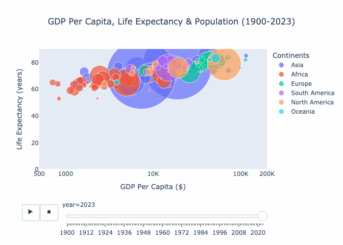

# Life Expectancy vs. GDP Per Capita (Animated Chart)

## 📌 Project Overview
This project visualizes the relationship between **life expectancy** and **GDP per capita** for countries around the world over a span of **100+ years**. The data is analyzed using **pandas**, and an **animated chart** is created using **Plotly**.

## 🎥 Final Output
The final animated chart is saved as a GIF:  
📂 

## 📊 Features
- **Time Series Analysis**: Uses historical data spanning over a century.  
- **Interactive Visualization**: Created with **Plotly** for rich visual representation.  
- **Animation**: Shows the progression of GDP per capita and life expectancy over time.  

## 🛠️ Technologies Used
- **Python**
- **pandas** (for data analysis)  
- **Plotly** (for visualization)
- **pycountry_convert** (for country code conversions)  
- **PIL (Pillow)** (for image processing)  
